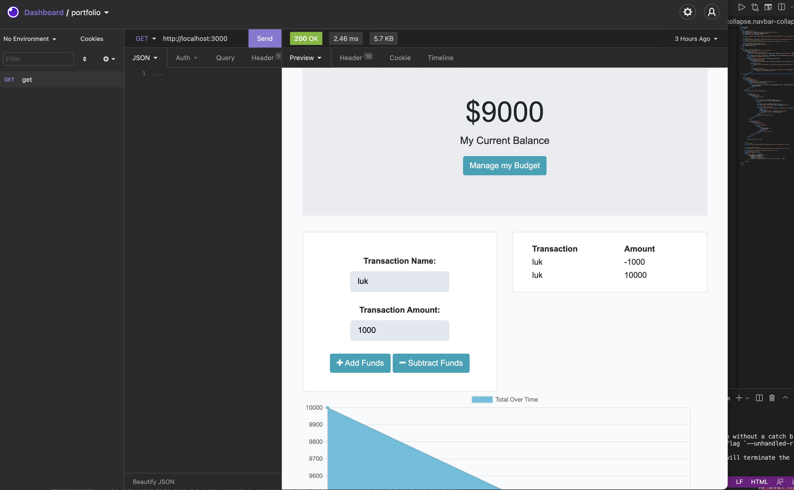

# budget-tracker-pwa

- Applying Progressive Web Application (PWA) this application enables the user to add expenses and deposits to their budget online or offline. When entering transactions offline, data should populate the total when connected back online.

### a glimse of the assignment
Heroku deployment: <a href="" target="_blank"> 

<h3>Assignment requirements</h3>

### User Story
AS AN avid traveller
I WANT to be able to track my withdrawals and deposits with or without a data/internet connection
SO THAT my account balance is accurate when I am traveling

### Acceptance Criteria
GIVEN a budget tracker without an internet connection
WHEN the user inputs an expense or deposit
THEN they will receive a notification that they have added an expense or deposit
WHEN the user reestablishes an internet connection
THEN the deposits or expenses added while they were offline are added to their transaction history and their totals are updated